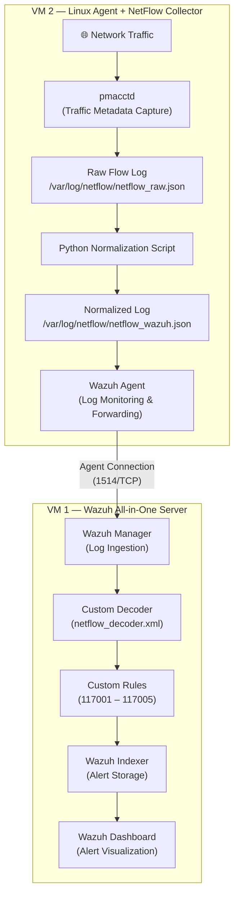

# Wazuh NetFlow Monitoring PoC

Network flow visibility integrated into Wazuh SIEM using pmacctd, Python log normalization, custom decoders, and custom detection rules — built on a simple two-VM architecture.

---

## Project Description

This project demonstrates how network traffic metadata (NetFlow) can be collected, normalized, forwarded, parsed, and alerted inside Wazuh SIEM without relying on a complex enterprise deployment.

The entire setup runs on two virtual machines. One VM hosts the Wazuh All-in-One stack (Manager, Indexer, Dashboard). The other VM runs a Wazuh Agent alongside pmacctd as the NetFlow collector and a Python script that normalizes raw flow data into a format Wazuh can parse.

The result is a working detection pipeline where network flow events trigger custom Wazuh alerts — giving SOC analysts visibility into traffic patterns, suspicious destinations, and anomalous connection behavior directly from the Wazuh Dashboard.

## Proof of Concept Objective

Show that Wazuh can be extended to monitor network flow metadata using open-source tools and lightweight custom integrations. This PoC is designed to be:

- Reproducible in a home lab or cloud environment
- Simple enough to understand and modify
- Realistic enough to demonstrate detection engineering skills

## Architecture Overview



## Data Flow

1. Network traffic passes through the Linux Agent VM.
2. `pmacctd` captures traffic metadata (source IP, destination IP, ports, protocol, bytes, packets).
3. Raw flow data is written to `/var/log/netflow/netflow_raw.json`.
4. A Python script reads the raw data and converts it into normalized JSON.
5. Normalized output is saved to `/var/log/netflow/netflow_wazuh.json`.
6. Wazuh Agent monitors the normalized log file using `localfile` configuration.
7. Events are forwarded to the Wazuh Manager over the agent connection.
8. The Wazuh Manager parses each event using a custom decoder.
9. Custom Wazuh rules evaluate decoded fields and generate alerts.
10. Alerts are visible in the Wazuh Dashboard for review and investigation.

## Technology Stack

| Component | Role |
|---|---|
| Wazuh Manager | Log ingestion, decoding, rule evaluation |
| Wazuh Indexer | Alert storage and indexing |
| Wazuh Dashboard | Alert visualization and investigation |
| Wazuh Agent | Log forwarding from the collector VM |
| pmacctd | Network traffic metadata capture |
| Python 3 | Raw flow log normalization |
| JSON | Log format for both raw and normalized data |
| Custom Decoder | Extracts NetFlow fields from normalized logs |
| Custom Rules | Generates alerts based on flow activity |

## Features

- Network flow metadata collection using pmacctd
- Python-based log normalization to structured JSON
- Custom Wazuh decoder for NetFlow field extraction
- Six detection use cases with custom Wazuh rules (ID 117001–117005)
- Full data pipeline from capture to dashboard alert
- Two-VM architecture — simple to deploy and reproduce
- Sample logs and alerts included for reference

## Directory Structure

```
wazuh-netflow-monitoring-poc/
├── README.md
├── LICENSE
├── .gitignore
│
├── docs/
│   ├── architecture.md
│   ├── installation.md
│   ├── configuration.md
│   ├── detection_logic.md
│   └── troubleshooting.md
│
├── configs/
│   ├── pmacctd/
│   │   └── pmacctd.conf
│   ├── wazuh_agent/
│   │   └── ossec.conf.snippet
│   └── wazuh_manager/
│       └── ossec.conf.snippet
│
├── scripts/
│   └── normalize_netflow_to_wazuh.py
│
├── rules/
│   ├── decoders/
│   │   └── netflow_decoder.xml
│   └── rules/
│       └── netflow_rules.xml
│
├── samples/
│   ├── raw/
│   │   └── netflow_raw_sample.json
│   ├── normalized/
│   │   └── netflow_wazuh_sample.json
│   └── alerts/
│       └── wazuh_alert_sample.json
│
└── screenshots/
    └── (Wazuh Dashboard alert screenshots)
```

## Installation

Refer to [docs/installation.md](docs/installation.md) for detailed setup instructions. High-level steps:

1. Deploy VM 1 with Wazuh All-in-One (Manager + Indexer + Dashboard).
2. Deploy VM 2 with a Linux OS (Ubuntu 22.04 or similar).
3. Install the Wazuh Agent on VM 2 and register it with the Manager.
4. Install pmacctd on VM 2.
5. Deploy the Python normalization script.
6. Add the custom decoder and rules to the Wazuh Manager.
7. Configure the Wazuh Agent to monitor the normalized log file.
8. Restart services and verify the data pipeline.

## Configuration

Refer to [docs/configuration.md](docs/configuration.md) for detailed configuration. Key files:

- **pmacctd**: `/etc/pmacct/pmacctd.conf` — captures traffic metadata and writes raw JSON.
- **Python script**: `/opt/netflow/normalize_netflow_to_wazuh.py` — converts raw data to normalized format.
- **Wazuh Agent**: `ossec.conf` localfile block — monitors `/var/log/netflow/netflow_wazuh.json`.
- **Wazuh Manager**: Custom decoder and rules loaded from `/var/ossec/etc/decoders/` and `/var/ossec/etc/rules/`.

## Example: Raw NetFlow Log

```json
{
  "event_type": "purge",
  "ip_src": "192.168.10.15",
  "ip_dst": "185.220.101.34",
  "port_src": 49832,
  "port_dst": 443,
  "ip_proto": "tcp",
  "packets": 12,
  "bytes": 3456,
  "stamp_inserted": "2025-01-15 10:32:01",
  "stamp_updated": "2025-01-15 10:32:30"
}
```

## Example: Normalized Wazuh JSON Log

```json
{
  "timestamp": "2025-01-15T10:32:01Z",
  "netflow": {
    "src_ip": "192.168.10.15",
    "dst_ip": "185.220.101.34",
    "src_port": 49832,
    "dst_port": 443,
    "protocol": "tcp",
    "packets": 12,
    "bytes": 3456,
    "duration_sec": 29
  }
}
```

## Example: Wazuh Alert Output

```json
{
  "rule": {
    "id": "117003",
    "level": 10,
    "description": "NetFlow: Suspicious external destination detected",
    "groups": ["netflow", "network_threat"]
  },
  "agent": {
    "id": "001",
    "name": "netflow-collector"
  },
  "data": {
    "netflow": {
      "src_ip": "192.168.10.15",
      "dst_ip": "185.220.101.34",
      "dst_port": 443,
      "protocol": "tcp",
      "bytes": 3456
    }
  },
  "timestamp": "2025-01-15T10:32:05Z"
}
```

## Detection Use Cases

| Rule ID | Level | Description |
|---|---|---|
| 117001 | 3 | NetFlow event received (base rule) |
| 117002 | 8 | High connection volume from a single source |
| 117003 | 10 | Suspicious external destination detected |
| 117004 | 6 | Repeated connection activity to the same destination |
| 117005 | 7 | Unusual destination port detected |

Each rule is documented in detail in [docs/detection_logic.md](docs/detection_logic.md).

## Troubleshooting

Common issues and solutions are documented in [docs/troubleshooting.md](docs/troubleshooting.md), including:

- Wazuh Agent not forwarding logs
- Decoder not matching normalized events
- Rules not triggering alerts
- pmacctd not capturing traffic
- Python script errors

## Limitations

This is a Proof of Concept and has intentional limitations:

- Two-VM architecture is not designed for production scale.
- pmacctd captures traffic metadata only from the collector VM's interfaces — it does not receive NetFlow exports from network devices.
- The Python normalization script runs as a scheduled task, not a real-time stream processor.
- No CDB list or threat intelligence feed is integrated for IP reputation.
- Rule thresholds are static and not tuned for production environments.
- No high availability or clustering is configured.

## Future Improvements

- Integrate a CDB list for known malicious IP lookups.
- Add support for NetFlow v5/v9 exports from network devices.
- Implement real-time normalization using a file watcher or daemon.
- Expand detection rules for lateral movement and data exfiltration patterns.
- Add MITRE ATT&CK technique mapping to each rule.
- Build a dedicated Wazuh Dashboard visualization for NetFlow alerts.
- Automate deployment using Ansible or shell scripts.

## Author

**Dimasqi Ramadhani**
Security Engineer — Detection Engineering & SIEM

- GitHub: [github.com/dimasqiramadhani](https://github.com/dimasqiramadhani)
- LinkedIn: [linkedin.com/in/dimasqiramadhani](https://linkedin.com/in/dimasqiramadhani)
- Email: dimasqiramadhani@gmail.com

## License

This project is licensed under the MIT License. See [LICENSE](LICENSE) for details.
