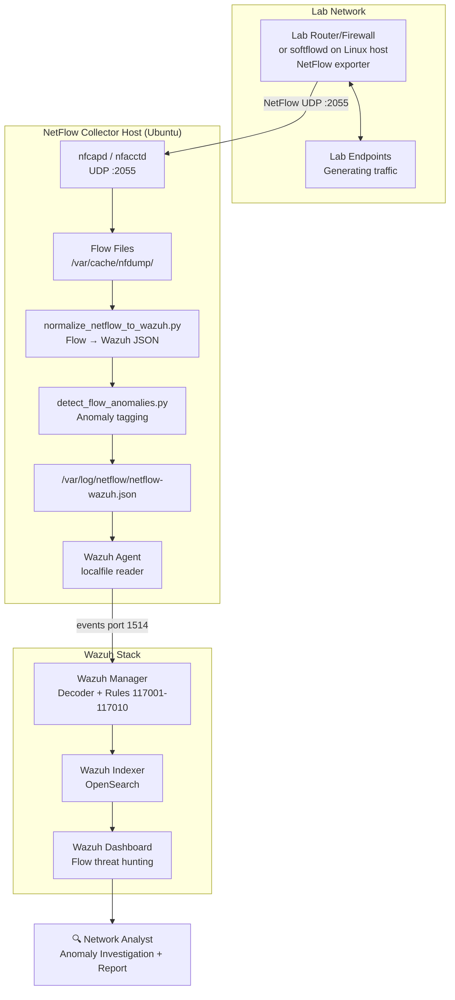

# 🌐 Network Flow Monitoring and Anomaly Detection with Wazuh

> NetFlow/IPFIX Visibility, Wazuh Log Collection, and Flow-Based Detection Engineering

A lab-based network security monitoring project that ingests **NetFlow/IPFIX flow telemetry** into **Wazuh** for flow-based anomaly detection and threat hunting. Unlike endpoint-centric SIEM deployments, this project adds **network visibility** — understanding who is talking to whom, how much, for how long, and whether those patterns look suspicious.

---

## 📌 Why This Project Matters

> *"Endpoints can lie. Network flows are harder to fake."*

Most SIEM deployments are log-centric: Windows Events, Linux syslog, application logs. NetFlow adds a complementary layer:

| Traditional SIEM | + NetFlow |
|----------------|-----------|
| "User logged in from IP" | + "That IP also sent 50GB outbound last night" |
| "Process created on host" | + "That host has been connecting to the same IP every 5 minutes for 3 days" |
| "Authentication failure" | + "Followed by lateral SMB connections to 12 internal hosts" |

NetFlow doesn't capture packet payloads — it captures **communication metadata**: who spoke to whom, on what port, for how long, how many bytes. That's often exactly what's needed for behavioral anomaly detection.

> **This is a lab-based portfolio project.** All IP addresses, hostnames, and flow data use dummy values. No real network traffic, no production credentials, no public exfiltration.

---

## 🧪 Lab Overview

| Component | Role |
|-----------|------|
| NetFlow Exporter | Lab router, firewall, or softflowd on Linux host |
| nfcapd / pmacct | Receives flow records on UDP port 2055 |
| Python Normalizer | Converts flow data to Wazuh-compatible JSON |
| Wazuh Agent | Reads normalized JSON via localfile |
| Custom Decoder | Parses NetFlow JSON fields |
| Custom Rules 117001–117010 | Flow anomaly detection |
| Wazuh Dashboard | Flow threat hunting and visualization |

---

## 🏗️ Architecture Diagram



---

## 🌊 NetFlow Concept

NetFlow records represent **conversations** between IP endpoints:

```
src=192.168.56.10  dst=203.0.113.50  sport=52341 dport=443  proto=TCP
bytes=48291  packets=42  duration=12.4s  flags=SYN,ACK,FIN
```

This single flow tells us: a lab host made an HTTPS connection to an external IP, transferred ~47KB in 12 seconds — without capturing any of the encrypted payload.

**NetFlow does NOT capture:**
- Passwords or credentials
- Encrypted payload content
- File contents being transferred
- HTTP headers or URLs (without enrichment)

**NetFlow DOES capture:**
- Communication patterns (who talks to whom)
- Volume anomalies (who sends too much)
- Behavioral patterns (beaconing, scanning)
- Protocol usage on unexpected ports

---

## 🎯 Detection Scope

| Detection | Flow Indicator | MITRE | Rule |
|-----------|---------------|-------|------|
| Port scanning | Many dst ports from one source | T1046 | 117001 |
| High outbound traffic | Large bytes outbound | T1041, T1567 | 117002 |
| Beaconing | Periodic same-dst connections | T1071 | 117003 |
| Lateral movement | Int→Int on SMB/RDP/SSH/WinRM | T1021 | 117004 |
| Suspicious DNS flow | High UDP/53 volume | T1071.004 | 117005 |
| External inbound sensitive | Ext→Int on admin ports | T1021 contextual | 117006 |
| Unusual dst port | Int→Ext on uncommon port | T1071 contextual | 117007 |
| DoS-like pattern | High packets to same dst | T1498 | 117008 |
| Multiple anomalies | 3+ alerts from same src | Multi | 117009 |

---

## 📁 Repository Structure

```
wazuh-netflow/
├── README.md
├── LICENSE
├── .gitignore
├── .env.example
├── docs/
│   └── 01-overview.md ... 19-improvement-ideas.md
├── collectors/
│   ├── nfdump/
│   │   ├── nfcapd-setup-notes.md
│   │   └── nfdump-export-json-notes.md
│   ├── pmacct/
│   │   ├── nfacctd-sample.conf
│   │   └── pmacct-json-output-notes.md
│   └── softflowd/
│       └── softflowd-exporter-notes.md
├── scripts/
│   ├── install_netflow_tools.sh
│   ├── start_nfcapd_collector.sh
│   ├── export_nfdump_to_json.sh
│   ├── normalize_netflow_to_wazuh.py
│   ├── generate_safe_netflow_test_events.py
│   ├── detect_flow_anomalies.py
│   ├── rotate_netflow_logs.sh
│   └── collect_netflow_evidence.sh
├── wazuh/
│   ├── ossec-localfile-netflow-snippet.xml
│   ├── agent-group-netflow-snippet.xml
│   ├── decoders/netflow_decoders.xml
│   └── rules/netflow_rules.xml
├── samples/
│   ├── sample-nfdump-output.txt
│   ├── sample-pmacct-json-flow.json
│   ├── sample-normalized-netflow-event.json
│   ├── sample-wazuh-alert-portscan.json
│   ├── sample-wazuh-alert-high-bytes-out.json
│   ├── sample-wazuh-alert-beaconing.json
│   ├── sample-wazuh-alert-lateral-movement.json
│   └── sample-wazuh-alert-suspicious-dns-flow.json
├── dashboards/
│   ├── dashboard-fields-and-filters.md
│   ├── saved-searches.md
│   └── visualization-guide.md
├── reports/
│   ├── sample-netflow-monitoring-report.md
│   ├── sample-network-anomaly-detection-report.md
│   └── sample-incident-investigation-report.md
└── screenshots/
    └── README.md
```

---

## ⚙️ Requirements

- Wazuh Server v4.x
- Ubuntu Server (collector host) with Wazuh Agent
- nfdump + nfcapd OR pmacct (nfacctd)
- Python 3.8+
- NetFlow exporter: lab router, softflowd, or sample generator
- Root/sudo access

---

## 🚀 Quick Start

### 1. Install Tools

```bash
sudo bash scripts/install_netflow_tools.sh
```

### 2. Start Collector

```bash
sudo bash scripts/start_nfcapd_collector.sh
```

### 3. Generate Test Events (No Exporter Needed)

```bash
python3 scripts/generate_safe_netflow_test_events.py
```

### 4. Deploy Wazuh Rules

```bash
sudo cp wazuh/decoders/netflow_decoders.xml /var/ossec/etc/decoders/
sudo cp wazuh/rules/netflow_rules.xml /var/ossec/etc/rules/
sudo systemctl restart wazuh-manager
```

### 5. Review in Dashboard

```
Filter: rule.groups:netflow
```

---

## 📚 References

- [Wazuh Documentation](https://documentation.wazuh.com/)
- [nfdump Project](https://github.com/phaag/nfdump)
- [pmacct Project](http://www.pmacct.net/)
- [MITRE ATT&CK TA0007 Discovery](https://attack.mitre.org/tactics/TA0007/)

---

## ⚖️ Disclaimer

Lab and portfolio use only. All IP addresses, hostnames, and flow data are fictional. No real network traffic captured, no production credentials, no real data exfiltration. Never capture or analyze traffic from networks you don't own or have authorization to monitor.

---

## 👤 Author

**Dimas Qi Ramadhani** — Cybersecurity Engineer | Network Security · SIEM · Detection Engineering  
GitHub: [@dimasqiramadhani](https://github.com/dimasqiramadhani)
