# 🌐 Network Flow Monitoring and Anomaly Detection with Wazuh

> NetFlow/IPFIX Visibility, Wazuh Log Collection, and Flow-Based Detection Engineering

A lab-based network security monitoring project that ingests **NetFlow/IPFIX flow telemetry** into **Wazuh** for flow-based anomaly detection and threat hunting. Unlike endpoint-centric SIEM deployments, this project adds **network visibility** — understanding who is talking to whom, how much, for how long, and whether those patterns look suspicious.

---

## 📌 Why This Project Matters

> *"Endpoints can lie. Network flows are harder to fake."*

Most SIEM deployments are log-centric: Windows Events, Linux syslog, application logs. NetFlow adds a complementary layer:

| Traditional SIEM | + NetFlow |
|----------------|-----------|
| "User logged in from IP" | + "That IP also sent 50GB outbound last night" |
| "Process created on host" | + "That host has been connecting to the same IP every 5 minutes for 3 days" |
| "Authentication failure" | + "Followed by lateral SMB connections to 12 internal hosts" |

NetFlow doesn't capture packet payloads — it captures **communication metadata**: who spoke to whom, on what port, for how long, how many bytes. That's often exactly what's needed for behavioral anomaly detection.

> **This is a lab-based portfolio project.** All IP addresses, hostnames, and flow data use dummy values. No real network traffic beyond the lab environment.

---

## 🧪 Lab Overview

| Component | Role |
|-----------|------|
| pmacctd | Captures flow records directly from network interface (primary collector) |
| Python Normalizer | Converts pmacct JSON output to Wazuh-compatible JSON |
| Wazuh Agent | Reads normalized JSON via localfile (`log_format: json`) |
| Custom Decoder | Identifies NetFlow JSON events by `@timestamp` prefix |
| Custom Rules 117000–117009 | Flow anomaly detection |
| Wazuh Dashboard | Flow threat hunting and visualization |

---

## 🏗️ Architecture

```mermaid
flowchart LR
    INTERNET(["🌐 Internet\nExternal Traffic"])
    ANALYST(["🔍 Analyst\nThreat Hunting"])

    subgraph VM2["💻 VM 2 — NetFlow Collector Host"]
        direction TB
        NIC[/"enp1s0\nNetwork Interface"/]
        PMACCT[["pmacctd\nDirect Capture"]]
        RAW[("netflow-raw.json\n/var/log/netflow/")]
        NORM[["normalize_netflow_to_wazuh.py\nCron · every 1 min"]]
        WAZUH_JSON[("netflow-wazuh.json\n/var/log/netflow/")]
        AGENT["Wazuh Agent\nlog_format: json"]

        NIC -->|"live packets"| PMACCT
        PMACCT -->|"flush 60s"| RAW
        RAW --> NORM
        NORM -->|"overwrite"| WAZUH_JSON
        WAZUH_JSON --> AGENT
    end

    subgraph VM1["🖥️ VM 1 — Wazuh Server All-in-One"]
        direction TB
        MANAGER["Wazuh Manager\nDecoder + Rules 117000–117009"]
        INDEXER[("Wazuh Indexer\nOpenSearch")]
        DASHBOARD["Wazuh Dashboard\nrule.groups:netflow"]

        MANAGER -->|"index"| INDEXER
        INDEXER --> DASHBOARD
    end

    INTERNET -->|"inbound/outbound"| NIC
    AGENT -->|"port 1514"| MANAGER
    DASHBOARD --> ANALYST
```



---

## 🌊 NetFlow Concept

NetFlow records represent **conversations** between IP endpoints:

```
src=192.168.1.10  dst=203.0.113.50  sport=52341  dport=443  proto=TCP
bytes=48291  packets=42  duration=12.4s
```

**NetFlow does NOT capture:** passwords, encrypted payload, file contents, HTTP URLs.

**NetFlow DOES capture:** communication patterns, volume anomalies, beaconing behavior, protocol usage on unexpected ports.

---

## 🎯 Detection Scope

| Detection | Flow Indicator | MITRE | Rule |
|-----------|---------------|-------|------|
| Port scanning | Many dst ports from one source | T1046 | 117001 |
| High outbound traffic | Large bytes outbound | T1041, T1567 | 117002 |
| Beaconing | Periodic same-dst connections | T1071 | 117003 |
| Lateral movement | Int→Int on SMB/RDP/SSH/WinRM | T1021 | 117004 |
| Suspicious DNS flow | High UDP/53 volume | T1071.004 | 117005 |
| External inbound sensitive | Ext→Int on admin ports | T1021 | 117006 |
| Unusual dst port | Int→Ext on uncommon port | T1071 | 117007 |
| DoS-like pattern | High packets to same dst | T1498 | 117008 |
| Multiple port scan anomalies | 3+ rule 117001 alerts from same src | T1046 | 117009 |

---

## ⚙️ Requirements

- **VM 1:** Wazuh Server v4.x (All-in-One: Manager + Indexer + Dashboard)
- **VM 2:** Ubuntu Server 20.04/22.04 (NetFlow Collector Host)
  - Wazuh Agent v4.x (same version as server)
  - pmacct (pmacctd)
  - Python 3.8+
- Root/sudo access on both VMs

---

## 🚀 Setup Guide

### VM 2 — NetFlow Collector Host

#### Step 1 — Install Wazuh Agent

```bash
WAZUH_MANAGER_IP="<IP_VM1>"

curl -s https://packages.wazuh.com/key/GPG-KEY-WAZUH | \
  gpg --no-default-keyring --keyring gnupg-ring:/usr/share/keyrings/wazuh.gpg \
  --import && chmod 644 /usr/share/keyrings/wazuh.gpg

echo "deb [signed-by=/usr/share/keyrings/wazuh.gpg] \
  https://packages.wazuh.com/4.x/apt/ stable main" | \
  sudo tee /etc/apt/sources.list.d/wazuh.list

sudo apt update
sudo WAZUH_MANAGER="$WAZUH_MANAGER_IP" apt install wazuh-agent -y
sudo systemctl enable wazuh-agent && sudo systemctl start wazuh-agent
```

#### Step 2 — Install Tools

```bash
sudo bash scripts/install_netflow_tools.sh
```

#### Step 3 — Jalankan pmacctd

Cek nama interface:

```bash
ip a  # catat nama interface, contoh: enp1s0, eth0
```

Jalankan collector:

```bash
bash collectors/pmacct/pmacct-collector.sh
# atau manual:
sudo pmacctd -i enp1s0 \
  -c src_host,dst_host,src_port,dst_port,proto \
  -P print -O json \
  -o /var/log/netflow/netflow-raw.json \
  -r 60 -D
```

Tunggu 65 detik, verifikasi:

```bash
cat /var/log/netflow/netflow-raw.json | head -3
# Harus muncul JSON dengan ip_src, ip_dst, ip_proto, packets, bytes
```

#### Step 4 — Konfigurasi INTERNAL_NETWORKS

Normalizer menggunakan `INTERNAL_NETWORKS` untuk menentukan `flow.direction`.
Sesuaikan dengan subnet IP lab lo — cek IP VM 2 dengan `ip a`.

```bash
# Cek IP aktual VM 2
ip a | grep "inet " | grep -v "127.0.0"
# Contoh output: inet 160.22.251.111/23

# Set INTERNAL_NETWORKS sesuai subnet — contoh jika IP 160.22.x.x/23
export INTERNAL_NETWORKS="160.22.250.0/23,192.168.56.0/24"

# Atau buat file .env di folder project
echo 'INTERNAL_NETWORKS=160.22.250.0/23,192.168.56.0/24' > .env
```

> **Penting:** Jika INTERNAL_NETWORKS tidak dikonfigurasi dengan subnet yang benar,
> semua traffic akan teklasifikasi sebagai `external_to_external` dan rule 117004
> (lateral movement) tidak akan pernah fired pada traffic nyata.

#### Step 5 — Konfigurasi Wazuh Agent localfile

Tambahkan ke `/var/ossec/etc/ossec.conf` sebelum `</ossec_config>` terakhir:

```xml
<localfile>
  <log_format>json</log_format>
  <location>/var/log/netflow/netflow-wazuh.json</location>
</localfile>
```

```bash
sudo systemctl restart wazuh-agent
```

#### Step 6 — Jalankan Normalizer

```bash
python3 scripts/normalize_netflow_to_wazuh.py \
  --pmacct /var/log/netflow/netflow-raw.json \
  --output /var/log/netflow/netflow-wazuh.json

# Verifikasi format nested JSON
head -1 /var/log/netflow/netflow-wazuh.json | \
  python3 -c "import sys,json; d=json.load(sys.stdin); print(d['flow']['protocol'], d['source']['ip'])"
# Harus output: TCP x.x.x.x (bukan PROTOtcp)
```

#### Step 7 — Setup Cron Otomatis

```bash
bash scripts/setup_cron.sh
# atau manual:
sudo crontab -e
# Tambahkan:
# * * * * * rm -f /var/log/netflow/netflow-wazuh.json && python3 /path/to/scripts/normalize_netflow_to_wazuh.py --pmacct /var/log/netflow/netflow-raw.json --output /var/log/netflow/netflow-wazuh.json
```

---

### VM 1 — Wazuh Server

#### Step 1 — Deploy Decoder

```bash
sudo cp wazuh/decoders/netflow_decoders.xml /var/ossec/etc/decoders/
sudo chown wazuh:wazuh /var/ossec/etc/decoders/netflow_decoders.xml
```

#### Step 2 — Deploy Rules

```bash
sudo cp wazuh/rules/netflow_rules.xml /var/ossec/etc/rules/
sudo chown wazuh:wazuh /var/ossec/etc/rules/netflow_rules.xml
```

#### Step 3 — Restart Wazuh Manager

```bash
sudo systemctl restart wazuh-manager
sudo systemctl status wazuh-manager | grep Active
# Harus: active (running)
```

#### Step 4 — Apply Index Template (untuk numeric fields)

Supaya field `data.network.bytes` dan `data.network.packets` bisa di-aggregate
(Sum/Avg) di Wazuh Dashboard:

```bash
curl -k -u admin:<password> \
  -X PUT "https://localhost:9200/_index_template/wazuh-netflow-numeric" \
  -H "Content-Type: application/json" \
  -d '{
    "index_patterns": ["wazuh-alerts-*"],
    "priority": 200,
    "template": {
      "mappings": {
        "properties": {
          "data.network.bytes":   {"type": "long"},
          "data.network.packets": {"type": "long"}
        }
      }
    }
  }'
```

Output yang diharapkan: `{"acknowledged":true}`

> Template berlaku untuk index **baru** (besok dan seterusnya). Index hari ini tidak berubah.

#### Step 5 — Validasi dengan wazuh-logtest

```bash
sudo /var/ossec/bin/wazuh-logtest
```

Generate satu baris event untuk di-paste:

```bash
# Di VM 2 — generate satu event dengan anomaly tag
python3 scripts/generate_safe_netflow_test_events.py --scenario port_scan --count 1
```

Copy output satu baris tersebut, paste ke prompt wazuh-logtest. Output yang diharapkan:

```
**Phase 2: Completed decoding.
        name: 'json'
        netflow: 'true'
        source: '{"ip": "192.168.56.x", "port": 48739}'
        destination: '{"ip": "192.168.56.x", "port": 47775}'
        flow: '{"protocol": "TCP", "direction": "internal_to_internal"}'
        anomaly: '{"tags": ["possible_port_scan"]}'

**Phase 3: Completed filtering (rules).
        id: '117001'
        level: '9'
**Alert to be generated.
```

---

## 🧪 Testing Detection Rules

Generate synthetic attack scenarios:

> ⚠️ **Penting:** Jika cron normalizer sedang aktif (setup_cron.sh sudah dijalankan),
> **pause dulu cron-nya** sebelum generate test events — karena cron akan overwrite file
> setiap menit dan events sintetis akan terhapus sebelum sempat dibaca Wazuh Agent.
>
> ```bash
> # Pause cron sementara
> sudo crontab -e  # comment out baris normalizer dengan #
> ```

```bash
# Di VM 2
python3 scripts/generate_safe_netflow_test_events.py \
  --scenario all \
  --output /var/log/netflow/netflow-wazuh.json
```

Setelah verifikasi alert masuk, aktifkan kembali cron:

```bash
sudo crontab -e  # hapus tanda # dari baris normalizer
```

Tunggu 30 detik, cek di VM 1:

```bash
sudo grep -E '"id":"11700[1-9]"' /var/ossec/logs/alerts/alerts.json | \
  python3 -c "
import sys, json
from collections import Counter
c = Counter(json.loads(l)['rule']['id'] for l in sys.stdin)
[print(k, v, 'alerts') for k, v in sorted(c.items())]
"
```

Expected output:
```
117001 25 alerts   ← Port scan
117002 5 alerts    ← High outbound
117003 8 alerts    ← Beaconing
117005 120 alerts  ← Suspicious DNS
```

---

## 📊 Wazuh Dashboard

Filter semua NetFlow events:
```
rule.groups: netflow
```

Filter per detection:

| Filter | Detection |
|--------|-----------|
| `rule.id: 117001` | Port scan |
| `rule.id: 117002` | High outbound |
| `rule.id: 117003` | Beaconing / C2 |
| `rule.id: 117004` | Lateral movement |
| `rule.id: 117005` | Suspicious DNS |

Lihat `dashboards/visualization-guide.md` untuk panduan membuat visualisasi.

---

## 📁 Repository Structure

```
netflow-network-traffic-monitoring/
├── README.md
├── .env.example                         ← konfigurasi environment variables
├── collectors/
│   └── pmacct/
│       ├── pmacct-collector.sh          ← jalankan ini untuk start pmacctd
│       ├── nfacctd-sample.conf          ← config file alternatif pmacctd
│       └── pmacct-json-output-notes.md
├── scripts/
│   ├── install_netflow_tools.sh         ← install pmacct + python deps
│   ├── setup_cron.sh                    ← setup automasi normalizer setiap menit
│   ├── normalize_netflow_to_wazuh.py    ← konversi pmacct JSON → Wazuh JSON
│   ├── detect_flow_anomalies.py         ← tagging anomali sebelum masuk Wazuh
│   ├── generate_safe_netflow_test_events.py  ← generate synthetic events untuk testing
│   ├── rotate_netflow_logs.sh           ← arsip netflow-raw.json harian
│   └── collect_netflow_evidence.sh      ← kumpulkan artefak saat investigasi
├── wazuh/
│   ├── ossec-localfile-netflow-snippet.xml  ← tambahkan ke ossec.conf agent
│   ├── agent-group-netflow-snippet.xml      ← opsional: centralized agent config
│   ├── decoders/netflow_decoders.xml
│   └── rules/netflow_rules.xml
├── samples/
│   ├── sample-pmacct-json-flow.json         ← contoh raw output pmacctd
│   ├── sample-normalized-netflow-event.json ← contoh output normalizer
│   └── sample-wazuh-alert-*.json            ← contoh alert per rule
├── dashboards/
│   ├── dashboard-fields-and-filters.md
│   ├── saved-searches.md
│   └── visualization-guide.md
├── docs/
│   ├── 01-overview.md
│   ├── 03-netflow-concept.md
│   ├── 04-netflow-vs-packet-capture.md
│   ├── 12-detection-use-cases.md
│   ├── 13-dashboard-and-threat-hunting-queries.md
│   ├── 15-incident-investigation-playbook.md
│   └── 17-troubleshooting.md
├── reports/
│   ├── sample-netflow-monitoring-report.md
│   ├── sample-network-anomaly-detection-report.md
│   └── sample-incident-investigation-report.md
└── screenshots/README.md
```

---

## 🐛 Common Issues

| Gejala | Penyebab | Fix |
|--------|----------|-----|
| Wazuh Manager gagal start | `<type>json</type>` di decoder | Deploy decoder versi terbaru |
| Rules 117001-117008 tidak fired | Prefix `data.` di field name | Deploy rules versi terbaru |
| `flow.protocol: PROTOtcp` | proto_map tidak handle string | Deploy normalizer versi terbaru |
| nfcapd "No matched flows" | Cloud VM hypervisor filtering | Gunakan pmacctd bukan nfcapd |
| Localfile duplicate warning | Entry ossec.conf dobel | Hapus salah satu entry |
| `source.ip` tidak muncul di dashboard | Flat dot-notation JSON conflict | Deploy normalizer versi terbaru (nested JSON) |
| Semua traffic `external_to_external` | INTERNAL_NETWORKS tidak dikonfigurasi | Set env var sesuai subnet lab, lihat Step 4 |
| `data.network.bytes` tidak bisa di-Sum | Field ter-index sebagai keyword | Apply index template, lihat Step 4 VM1 |

Lihat `docs/17-troubleshooting.md` untuk detail lengkap.

---

## 📚 References

- [Wazuh Documentation](https://documentation.wazuh.com/)
- [pmacct Project](http://www.pmacct.net/)
- [MITRE ATT&CK T1046](https://attack.mitre.org/techniques/T1046/)
- [MITRE ATT&CK T1071](https://attack.mitre.org/techniques/T1071/)

---

## ⚖️ Disclaimer

Lab and portfolio use only. All IP addresses, hostnames, and flow data are fictional. Never capture or analyze traffic from networks you don't own or have explicit authorization to monitor.

---

## 👤 Author

**Dimas Qi Ramadhani** — Cybersecurity Engineer | Network Security · SIEM · Detection Engineering  
GitHub: [@dimasqiramadhani](https://github.com/dimasqiramadhani)  
Email: dimasqiramadhani@gmail.com  
LinkedIn: [linkedin.com/in/dimasqiramadhani](https://linkedin.com/in/dimasqiramadhani)
