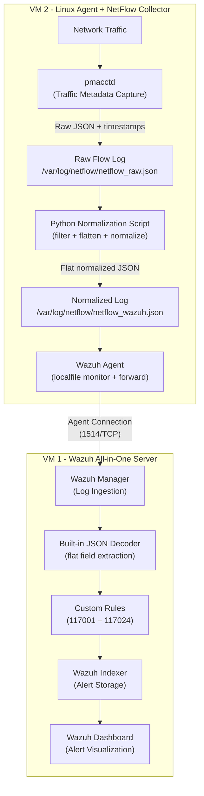

# Wazuh NetFlow Monitoring PoC

Network flow visibility integrated into Wazuh SIEM using pmacctd, Python log normalization, custom decoders, and 24 detection rules - built on a simple two-VM architecture and validated against real internet traffic.

## Screenshots

### Dashboard Overview


### High Severity Alerts (Level 9+)


### External Threats Only


### Top Attacker IPs


### Logtest - RDP Rule 117010 (Level 12)


### Logtest - Telnet Rule 117013 (Level 10)


### Logtest - Database Rule 117015 (Level 10)


### Logtest - Suspicious Port Rule 117003 (Level 7)


### Logtest - NetBIOS Rule 117020 (Level 9)


## Project Description

This project demonstrates how network traffic metadata (NetFlow) can be collected, normalized, forwarded, parsed, and alerted inside Wazuh SIEM without relying on a complex enterprise deployment.

The setup runs on two virtual machines. One VM hosts the Wazuh All-in-One stack (Manager, Indexer, Dashboard). The other VM runs a Wazuh Agent alongside pmacctd as the NetFlow collector and a Python script that normalizes raw flow data into a format Wazuh can parse.

All detection rules were validated against real internet traffic. The VM was exposed to the internet and within hours was being scanned by automated tools targeting RDP, Telnet, MySQL, PostgreSQL, NetBIOS, and other services.

## Proof of Concept Objective

Show that Wazuh can be extended to monitor network flow metadata using open-source tools and lightweight custom integrations. This PoC is designed to be:

- Reproducible in a home lab or cloud environment
- Simple enough to understand and modify
- Realistic enough to demonstrate detection engineering skills
- Validated with real traffic data

## Architecture Overview



## Data Flow

1. Network traffic passes through the Linux Agent VM interface.
2. `pmacctd` captures traffic metadata with timestamps (`timestamp_start`, `timestamp_end`).
3. Raw flow data is written to `/var/log/netflow/netflow_raw.json`.
4. A Python script reads raw data, filters noise (multicast, broadcast, loopback, internal subnet), and outputs flat normalized JSON.
5. Normalized output is saved to `/var/log/netflow/netflow_wazuh.json`.
6. Wazuh Agent monitors the normalized log file using `localfile` configuration.
7. Events are forwarded to the Wazuh Manager over the agent connection (port 1514/TCP).
8. The Wazuh Manager parses each event using the built-in JSON decoder.
9. Custom rules (117001–117024) evaluate decoded fields and generate alerts.
10. Alerts are visible in the Wazuh Dashboard for review and investigation.

## Technology Stack

| Component          | Role                                        |
|--------------------|---------------------------------------------|
| Wazuh Manager 4.14 | Log ingestion, decoding, rule evaluation    |
| Wazuh Indexer      | Alert storage and indexing                  |
| Wazuh Dashboard    | Alert visualization and investigation       |
| Wazuh Agent 4.14   | Log forwarding from the collector VM        |
| pmacctd 1.7.6      | Network traffic metadata capture            |
| Python 3           | Raw flow log normalization and filtering    |
| JSON               | Log format for both raw and normalized data |
| Custom Rules (24)  | Generates alerts based on flow activity     |

## Features

- Network flow metadata collection using pmacctd with real timestamps
- Python-based log normalization to flat structured JSON
- Automatic filtering of multicast, broadcast, loopback, and internal traffic
- 24 custom Wazuh detection rules (ID 117001–117024)
- Full data pipeline from capture to dashboard alert
- Two-VM architecture - simple to deploy and reproduce
- Validated against real internet traffic with confirmed detections

## Directory Structure

```
wazuh-netflow-monitoring-poc/
├── README.md
├── LICENSE
├── .gitignore
│
├── docs/
│   ├── architecture.md
│   ├── installation.md
│   ├── configuration.md
│   ├── detection_logic.md
│   ├── troubleshooting.md
│   └── portfolio_content.md
│
├── configs/
│   ├── pmacctd/
│   │   └── pmacctd.conf
│   ├── wazuh_agent/
│   │   └── ossec.conf.snippet
│   └── wazuh_manager/
│       └── ossec.conf.snippet
│
├── scripts/
│   └── normalize_netflow_to_wazuh.py
│
├── rules/
│   ├── decoders/
│   │   └── netflow_decoder.xml
│   └── rules/
│       └── netflow_rules.xml
│
├── samples/
│   ├── raw/
│   │   └── netflow_raw_sample.json
│   ├── normalized/
│   │   └── netflow_wazuh_sample.json
│   └── alerts/
│       └── wazuh_alert_sample.json
│
└── screenshots/
    └── (Wazuh Dashboard alert screenshots)
```

## Installation

Refer to [docs/installation.md](docs/installation.md) for detailed setup instructions. High-level steps:

1. Deploy VM 1 with Wazuh All-in-One (Manager + Indexer + Dashboard).
2. Deploy VM 2 with Ubuntu 22.04.
3. Install the Wazuh Agent on VM 2 and register it with the Manager.
4. Install pmacctd on VM 2.
5. Deploy the Python normalization script to `/opt/netflow/`.
6. Add the custom rules to the Wazuh Manager.
7. Configure the Wazuh Agent to monitor the normalized log file.
8. Set up a cron job to run the normalization script every minute.
9. Restart services and verify the data pipeline.

## Configuration

Key files:

- **pmacctd**: `/etc/pmacct/pmacctd.conf` - captures traffic with timestamps, writes raw JSON.
- **Python script**: `/opt/netflow/normalize_netflow_to_wazuh.py` - filters and normalizes raw data.
- **Wazuh Agent**: `ossec.conf` localfile block - monitors `/var/log/netflow/netflow_wazuh.json`.
- **Wazuh Rules**: `/var/ossec/etc/rules/netflow_rules.xml` - 24 detection rules.

### Important: Flat JSON Format

Wazuh 4.x does not support dot notation in rule `<field>` tags for nested JSON. The normalization script outputs **flat JSON** with field names prefixed `nf_` (e.g. `nf_src_ip`, `nf_dst_port`).

### Internal Subnet Filter

Edit `INTERNAL_PREFIX` in the normalization script to match your environment:

```python
INTERNAL_PREFIX = "160.22."  # adjust to your cloud/lab subnet
```

## Example: Raw NetFlow Log (pmacctd output)

```json
{
  "event_type": "purge",
  "ip_src": "87.251.64.25",
  "ip_dst": "160.22.251.9",
  "port_src": 15844,
  "port_dst": 3389,
  "ip_proto": "tcp",
  "tos": 0,
  "timestamp_start": "2026-05-26 09:50:32.000000",
  "timestamp_end": "0000-00-00 00:00:00.000000",
  "packets": 5,
  "bytes": 240
}
```

## Example: Normalized Wazuh JSON Log

```json
{
  "timestamp": "2026-05-26T09:50:32Z",
  "nf_src_ip": "87.251.64.25",
  "nf_dst_ip": "160.22.251.9",
  "nf_src_port": "15844",
  "nf_dst_port": "3389",
  "nf_protocol": "tcp",
  "nf_packets": "5",
  "nf_bytes": "240",
  "nf_duration": "0"
}
```

## Example: Wazuh Alert Output

```json
{
  "timestamp": "2026-05-26T16:50:34.984+0700",
  "rule": {
    "id": "117010",
    "level": 12,
    "description": "NetFlow: RDP access attempt from external host 87.251.64.25",
    "groups": ["netflow", "network_anomaly", "remote_access"]
  },
  "agent": {
    "id": "001",
    "name": "ubnsrv-netflow",
    "ip": "160.22.251.9"
  },
  "data": {
    "nf_src_ip": "87.251.64.25",
    "nf_dst_ip": "160.22.251.9",
    "nf_dst_port": "3389",
    "nf_protocol": "tcp"
  }
}
```

## Detection Rules

| Rule ID | Level | Category         | Description                                 |
|---------|-------|------------------|---------------------------------------------|
| 117001  | 3     | Base             | NetFlow event received                      |
| 117002  | 8     | Anomaly          | High connection volume from single source   |
| 117003  | 7     | Anomaly          | Suspicious destination port detected        |
| 117004  | 6     | Anomaly          | Repeated connection to same destination     |
| 117005  | 10    | Exfiltration     | Large data transfer detected (>500KB)       |
| 117006  | 8     | DoS              | ICMP flood detected                         |
| 117007  | 8     | DoS              | UDP flood detected                          |
| 117008  | 10    | Brute Force      | Possible SSH brute force                    |
| 117009  | 9     | Recon            | Possible port scan                          |
| 117010  | 12    | Remote Access    | **RDP access attempt**                      |
| 117011  | 10    | Tunneling        | High volume DNS - possible tunneling        |
| 117012  | 9     | Lateral Movement | SMB traffic detected                        |
| 117013  | 10    | Cleartext        | **Telnet connection detected**              |
| 117014  | 8     | Cleartext        | **FTP connection detected**                 |
| 117015  | 10    | Database         | **Database port access from external**      |
| 117016  | 11    | Evasion          | Tor-related port detected                   |
| 117017  | 9     | Policy           | Cryptocurrency mining port                  |
| 117018  | 10    | Exfiltration     | High outbound traffic volume                |
| 117019  | 8     | Recon            | SNMP traffic detected                       |
| 117020  | 9     | Lateral Movement | **NetBIOS traffic detected**                |
| 117021  | 11    | C2               | Possible C2 beaconing                       |
| 117022  | 8     | Remote Access    | **VNC remote access port detected**         |
| 117023  | 10    | Recon            | LDAP reconnaissance detected                |
| 117024  | 12    | Exfiltration     | High bytes over DNS - possible exfiltration |

**Bold** = Confirmed firing against real internet traffic in lab.

## Real Traffic Detection Results

This PoC was validated on a live cloud VM (Ubuntu 22.04, Eranya Cloud). Within hours of deployment, the following real threats were detected:

| Rule              | Attacker IP                             | Finding                                     |
|-------------------|-----------------------------------------|---------------------------------------------|
| 117010 (RDP)      | 87.251.64.25                            | Automated RDP scanner - 4 hits in <1 second |
| 117013 (Telnet)   | 43.241.37.250, 198.46.134.48 + 6 others | Telnet scanner from 8 different IPs         |
| 117015 (Database) | 45.156.87.127                           | MySQL port 3306 scan                        |
| 117015 (Database) | 64.89.163.133                           | PostgreSQL port 5432 scan                   |
| 117020 (NetBIOS)  | 103.153.61.85                           | NetBIOS broadcast - 29 hits                 |
| 117022 (VNC)      | 45.227.x.x                              | VNC port 5900 scan                          |
| 117014 (FTP)      | 212.73.x.x                              | FTP port 21 access                          |

Total alerts in 24 hours: **1,916** - with **187** at level 7 or above.

## Troubleshooting

Refer to [docs/troubleshooting.md](docs/troubleshooting.md) for common issues including:

- pmacctd not capturing traffic
- Normalization script processed 0 records
- Wazuh Agent not forwarding logs
- Rules not triggering alerts
- False positives from multicast/internal traffic

## Known Limitations

- Two-VM architecture is not designed for production scale.
- pmacctd captures traffic only from the collector VM's local interface.
- The normalization script runs as a scheduled task (cron), not a real-time stream processor.
- No CDB list or threat intelligence feed for IP reputation lookup.
- Rule thresholds are not tuned for high-volume production environments.
- Internal subnet filter (`INTERNAL_PREFIX`) must be manually adjusted per environment.

## Future Improvements

- Integrate CDB list for known malicious IP lookups.
- Add MITRE ATT&CK technique mapping to each rule.
- Implement real-time normalization using a file watcher daemon.
- Add support for NetFlow v5/v9 exports from network devices.
- Build a dedicated Wazuh Dashboard visualization for NetFlow alerts.
- Automate deployment using Ansible or shell scripts.
- Expand rule 117003 suspicious port list based on threat intelligence.

## Author

Dimasqi Ramadhani, Security Engineer

- [Portfolio](https://dimasqiramadhani.com)
- [GitHub](https://github.com/dimasqiramadhani)
- [Linkedin](https://linkedin.com/in/dimasqiramadhani)

## License

This project is licensed under the MIT License. See [LICENSE](LICENSE) for details.