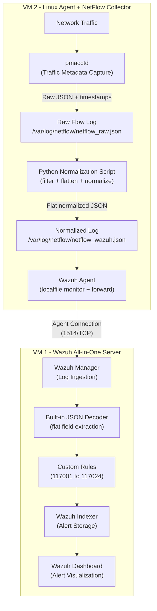

# NetFlow Integration for Network Visibility and Detection Engineering

Network flow visibility integrated into Wazuh SIEM using pmacctd, Python log normalization, and 24 detection rules, built on a two VM architecture and validated against real internet traffic.

All addresses, hostnames, and interface names in this repository are placeholders. The traffic samples and the detection results are real; the environment they came from is not identifiable from what is published here.

## Project Description

This project demonstrates how network traffic metadata (NetFlow) can be collected, normalized, forwarded, parsed, and alerted inside Wazuh SIEM without relying on a complex enterprise deployment.

The setup runs on two virtual machines. One VM hosts the Wazuh All in One stack (Manager, Indexer, Dashboard). The other VM runs a Wazuh Agent alongside pmacctd as the NetFlow collector and a Python script that normalizes raw flow data into a format Wazuh can parse.

All detection rules were validated against real internet traffic. The VM was exposed to the internet and within hours was being scanned by automated tools targeting RDP, Telnet, MySQL, PostgreSQL, NetBIOS, and other services.

## Proof of Concept Objective

Show that Wazuh can be extended to monitor network flow metadata using open source tools and lightweight custom integrations. This PoC is designed to be:

* Reproducible in a home lab or cloud environment
* Simple enough to understand and modify
* Realistic enough to demonstrate detection engineering skills
* Validated with real traffic data

## Architecture Overview


```mermaid
flowchart TD
    subgraph VM2["VM 2 - Linux Agent + NetFlow Collector"]
        A["Network Traffic"] --> B["pmacctd\n(Traffic Metadata Capture)"]
        B -->|"Raw JSON + timestamps"| C["Raw Flow Log\n/var/log/netflow/netflow_raw.json"]
        C --> D["Python Normalization Script\n(filter + flatten + normalize)"]
        D -->|"Flat normalized JSON"| E["Normalized Log\n/var/log/netflow/netflow_wazuh.json"]
        E --> F["Wazuh Agent\n(localfile monitor + forward)"]
    end

    subgraph VM1["VM 1 - Wazuh All-in-One Server"]
        G["Wazuh Manager\n(Log Ingestion)"]
        G --> H["Built-in JSON Decoder\n(flat field extraction)"]
        H --> I["Custom Rules\n(117001 to 117024)"]
        I --> J["Wazuh Indexer\n(Alert Storage)"]
        J --> K["Wazuh Dashboard\n(Alert Visualization)"]
    end

    F -- "Agent Connection\n(1514/TCP)" --> G
```

## Data Flow

1. Network traffic passes through the Linux Agent VM interface.
2. `pmacctd` captures traffic metadata with timestamps (`timestamp_start`, `timestamp_end`).
3. Raw flow data is written to `/var/log/netflow/netflow_raw.json`.
4. A Python script reads the new lines since its last run, drops noise on either endpoint (multicast, broadcast, loopback, IPv6 link local) and drops flows where both endpoints are internal, then outputs flat normalized JSON.
5. Normalized output is saved to `/var/log/netflow/netflow_wazuh.json`.
6. Wazuh Agent monitors the normalized log file using `localfile` configuration.
7. Events are forwarded to the Wazuh Manager over the agent connection (port 1514/TCP).
8. The Wazuh Manager parses each event using the built in JSON decoder.
9. Custom rules (117001 to 117024) evaluate decoded fields and generate alerts.
10. Alerts are visible in the Wazuh Dashboard for review and investigation.

Two intervals set the pace of the whole pipeline. pmacctd flushes accumulated flows every
60 seconds, and the normalization script runs once a minute from cron, so an event reaches
the dashboard roughly one to two minutes after the packet was seen. The script tracks the
last line it processed in `/var/log/netflow/.last_processed_line`, so the two schedules do
not need to align and nothing is processed twice.

## Technology Stack

| Component          | Role                                        |
|--------------------|---------------------------------------------|
| Wazuh Manager 4.14 | Log ingestion, decoding, rule evaluation    |
| Wazuh Indexer      | Alert storage and indexing                  |
| Wazuh Dashboard    | Alert visualization and investigation       |
| Wazuh Agent 4.14   | Log forwarding from the collector VM        |
| pmacctd 1.7.6      | Network traffic metadata capture            |
| Python 3           | Raw flow log normalization and filtering    |
| JSON               | Log format for both raw and normalized data |
| Custom Rules (24)  | Generates alerts based on flow activity     |

## Features

* Network flow metadata collection using pmacctd with real timestamps
* Log normalization in Python to flat structured JSON
* Filtering of multicast, broadcast, loopback, and internal to internal traffic
* 24 custom Wazuh detection rules, IDs 117001 to 117024
* Full data pipeline from capture to dashboard alert
* Two VM architecture, simple to deploy and reproduce
* Validated against real internet traffic with confirmed detections

## Directory Structure

```
.
├── README.md
├── LICENSE
│
├── docs/
│   ├── ARCHITECTURE.md        # two VM design, components, data flow, decisions
│   ├── INSTALLATION.md        # step by step setup on both VMs
│   ├── CONFIGURATION.md       # pmacctd, normalization script, agent, rotation
│   ├── DETECTION_LOGIC.md     # field reference, rule by rule logic, thresholds
│   ├── TROUBLESHOOTING.md     # symptoms seen during the build and their fixes
│   ├── EVALUATION.md          # audit of this repository against its own evidence
│   └── PORTFOLIO_CONTENT.md   # description text for the repository and posts
│
├── configs/
│   ├── pmacctd/               # collector config
│   ├── wazuh_agent/           # localfile block for the agent
│   └── wazuh_manager/         # ruleset note for the manager
│
├── scripts/
│   └── normalize_netflow_to_wazuh.py
│
├── wazuh_ruleset/
│   ├── decoders/              # optional, see INSTALLATION.md
│   └── rules/                 # the 24 detection rules
│
├── samples/
│   ├── raw/                   # pmacctd output as captured
│   ├── normalized/            # what the script produces from it
│   └── alerts/                # what Wazuh produces from that
│
└── screenshots/
```

Read `docs/ARCHITECTURE.md` first to understand the shape, then follow
`docs/INSTALLATION.md` and `docs/CONFIGURATION.md` to build it. `docs/DETECTION_LOGIC.md`
explains what each rule looks for, and `docs/EVALUATION.md` records where this repository
and its own evidence disagreed.

`samples/raw/` and `samples/normalized/` hold the same six flows before and after the
script, so reading them side by side shows exactly what normalization changes.
`samples/alerts/` comes from a longer capture and covers eight alerts across seven rules,
so it is not the same six flows.

## Placeholders

Nothing here carries a value from the environment it was built in. Replace each of these
before running anything.

| Placeholder            | What it is                                    | Where to set it                          |
|------------------------|-----------------------------------------------|------------------------------------------|
| `<COLLECTOR_IP>`       | address of VM 2, the agent and collector      | appears in samples and examples only     |
| `<MANAGER_IP>`         | address of VM 1, the Wazuh server             | agent install, `ossec.conf`              |
| `<INTERNAL_PREFIX>`    | address prefix of the subnet VM 2 sits in     | `normalize_netflow_to_wazuh.py`          |
| `<CAPTURE_INTERFACE>`  | interface pmacctd listens on, `ip link show`  | `configs/pmacctd/pmacctd.conf`           |
| `<AGENT_NAME>`         | name the agent registers under                | agent install                            |
| `<MANAGER_NAME>`       | hostname of the Wazuh server                  | appears in sample alerts only            |

The attacker addresses further down are left intact. They are external scanning hosts
observed from the internet rather than anything belonging to this environment, and
redacting them would remove the only evidence that the rules fire on real traffic.

## Installation

Refer to [docs/INSTALLATION.md](docs/INSTALLATION.md) for detailed setup instructions. In outline:

1. Deploy VM 1 with Wazuh All in One (Manager + Indexer + Dashboard).
2. Deploy VM 2 with Ubuntu 22.04.
3. Install the Wazuh Agent on VM 2 and register it with the Manager.
4. Install pmacctd on VM 2.
5. Deploy the Python normalization script to `/opt/netflow/`.
6. Add the custom rules to the Wazuh Manager.
7. Configure the Wazuh Agent to monitor the normalized log file.
8. Set up a cron job to run the normalization script every minute.
9. Restart services and verify the data pipeline.

## Configuration

Key files:

* **pmacctd**: `/etc/pmacct/pmacctd.conf`, captures traffic with timestamps and writes raw JSON.
* **Python script**: `/opt/netflow/normalize_netflow_to_wazuh.py`, filters and normalizes raw data.
* **Wazuh Agent**: the `localfile` block in `ossec.conf`, monitors `/var/log/netflow/netflow_wazuh.json`.
* **Wazuh Rules**: `/var/ossec/etc/rules/netflow_rules.xml`, the 24 detection rules.

### Important: Flat JSON Format

Wazuh 4.x does not support dot notation in rule `<field>` tags for nested JSON. The normalization script outputs **flat JSON** with field names prefixed `nf_` (e.g. `nf_src_ip`, `nf_dst_port`).

### Internal Subnet Filter

Edit `INTERNAL_PREFIX` in the normalization script to match your environment:

```python
INTERNAL_PREFIX = "192.168."   # the prefix of the subnet the collector sits in
```

The prefix drops a flow only when **both** endpoints are internal. Applying it to either
endpoint would discard every inbound flow, since the destination of inbound traffic is
always the collector itself, which is the traffic these rules exist to catch. See
`docs/EVALUATION.md`, finding 1.

## Example: Raw NetFlow Log (pmacctd output)

```json
{
  "event_type": "purge",
  "ip_src": "87.251.64.25",
  "ip_dst": "<COLLECTOR_IP>",
  "port_src": 15844,
  "port_dst": 3389,
  "ip_proto": "tcp",
  "tos": 0,
  "timestamp_start": "2026-05-26 09:50:32.000000",
  "timestamp_end": "0000-00-00 00:00:00.000000",
  "packets": 5,
  "bytes": 240
}
```

## Example: Normalized Wazuh JSON Log

```json
{
  "timestamp": "2026-05-26T09:50:32Z",
  "nf_src_ip": "87.251.64.25",
  "nf_dst_ip": "<COLLECTOR_IP>",
  "nf_src_port": 15844,
  "nf_dst_port": 3389,
  "nf_protocol": "tcp",
  "nf_packets": 5,
  "nf_bytes": 240,
  "nf_duration": 0
}
```

Numeric fields are emitted as JSON numbers. They appear quoted in the alert further down
because the Wazuh JSON decoder converts every value to a string when it fills the alert
`data` block, which is also why numeric aggregation in OpenSearch needs the scripted fields
described in `docs/DETECTION_LOGIC.md`.

## Example: Wazuh Alert Output

```json
{
  "timestamp": "2026-05-26T16:50:34.984+0700",
  "rule": {
    "id": "117010",
    "level": 12,
    "description": "NetFlow: RDP access attempt from external host 87.251.64.25",
    "groups": ["netflow", "network_anomaly", "remote_access"]
  },
  "agent": {
    "id": "001",
    "name": "<AGENT_NAME>",
    "ip": "<COLLECTOR_IP>"
  },
  "data": {
    "nf_src_ip": "87.251.64.25",
    "nf_dst_ip": "<COLLECTOR_IP>",
    "nf_dst_port": "3389",
    "nf_protocol": "tcp"
  }
}
```

## Detection Rules

| Rule ID | Level | Category         | Description                                 |
|---------|-------|------------------|---------------------------------------------|
| 117001  | 3     | Base             | **NetFlow event received**                  |
| 117002  | 8     | Anomaly          | **High connection volume from single source** |
| 117003  | 7     | Anomaly          | **Suspicious destination port detected**    |
| 117004  | 6     | Anomaly          | **Repeated connection to same destination** |
| 117005  | 10    | Exfiltration     | Large data transfer detected (>500KB)       |
| 117006  | 8     | DoS              | ICMP flood detected                         |
| 117007  | 8     | DoS              | UDP flood detected                          |
| 117008  | 10    | Brute Force      | **Possible SSH brute force**                |
| 117009  | 9     | Recon            | Possible port scan                          |
| 117010  | 12    | Remote Access    | **RDP access attempt**                      |
| 117011  | 10    | Tunneling        | High volume DNS, possible tunneling        |
| 117012  | 9     | Lateral Movement | SMB traffic detected                        |
| 117013  | 10    | Cleartext        | **Telnet connection detected**              |
| 117014  | 8     | Cleartext        | FTP connection detected                     |
| 117015  | 10    | Database         | **Database port access from external**      |
| 117016  | 11    | Evasion          | Tor related port detected                   |
| 117017  | 9     | Policy           | Cryptocurrency mining port                  |
| 117018  | 10    | Exfiltration     | **High outbound traffic volume**            |
| 117019  | 8     | Recon            | SNMP traffic detected                       |
| 117020  | 9     | Lateral Movement | **NetBIOS traffic detected**                |
| 117021  | 11    | C2               | **Possible C2 beaconing**                   |
| 117022  | 8     | Remote Access    | **VNC remote access port detected**         |
| 117023  | 10    | Recon            | LDAP reconnaissance detected                |
| 117024  | 12    | Exfiltration     | High bytes over DNS, possible exfiltration |

**Bold** = observed firing against real traffic. Twelve of the twenty four rules have
evidence behind them: 117001, 117002, 117003, 117004, 117008, 117010, 117013, 117015,
117018, 117020, 117021, and 117022. Ten of those appear in the dashboard breakdown in
`screenshots/Dashboard_Overview.png` and the other two in `samples/alerts/`.

The remaining twelve are written and loaded but have not been seen firing. Half a ruleset
unfired is a normal result for a single host over a single day, and it points at real work
rather than at a gap to hide: several of those rules have frequency thresholds set for a
busier link than this one.

## Real Traffic Detection Results

This PoC was validated on a live cloud VM (Ubuntu 22.04, Eranya Cloud). Within hours of deployment, the following real threats were detected:

| Rule              | Attacker IP                             | Finding                                     |
|-------------------|-----------------------------------------|---------------------------------------------|
| 117010 (RDP)      | 87.251.64.25                            | Automated RDP scanner, 4 hits in <1 second |
| 117013 (Telnet)   | 43.241.37.250, 198.46.134.48 + 6 others | Telnet scanner from 8 different IPs         |
| 117015 (Database) | 45.156.87.127                           | MySQL port 3306 scan                        |
| 117015 (Database) | 64.89.163.133                           | PostgreSQL port 5432 scan                   |
| 117020 (NetBIOS)  | 103.153.61.85                           | NetBIOS traffic, 2,470 hits on port 137 and 114 on port 138 |
| 117022 (VNC)      | 45.227.x.x                              | VNC port 5900 scan                          |
| 117014 (FTP)      | 212.73.x.x                              | FTP port 21 access                          |

Total firing events over the 24 hour window shown on the dashboard: **4,472**, across
**10** threat categories. NetBIOS traffic from a single source accounts for well over half
of that on its own, which is worth knowing before reading the total as a measure of how
much genuinely distinct activity was seen.

These are the figures from `screenshots/Dashboard_Overview.png`. Three different totals
appeared across the documents before this was checked against the dashboard; see
`docs/EVALUATION.md`, finding 4.

## Screenshots

Captured from the running deployment, in `screenshots/`.

| File                                  | What it shows                                                |
|---------------------------------------|--------------------------------------------------------------|
| `Dashboard_Overview.png`              | the NetFlow dashboard, alert timeline and category breakdown |
| `Top_Attacker_IPs.png`                | the source addresses generating the most alerts              |
| `High_Severity_Level_9_Plus.png`      | alerts filtered to level 9 and above                         |
| `External_Threat_Only.png`            | alerts filtered to external sources                          |
| `Wazuh_Logtest_RDP_Alerts.png`        | rule 117010 firing in `wazuh-logtest`                        |
| `Wazuh_Logtest_Telnet_Alerts.png`     | rule 117013 firing in `wazuh-logtest`                        |
| `Wazuh_Logtest_Database_Alerts.png`   | rule 117015 firing in `wazuh-logtest`                        |
| `Wazuh_Logtest_NetBIOS_Alerts.png`    | rule 117020 firing in `wazuh-logtest`                        |
| `Wazuh_Logtest_Suspicious_Alerts.png` | rule 117003 firing in `wazuh-logtest`                        |
| `Cover_Image.png`                     | cover image used at the top of this page                     |

The dashboard visualizations exist and are shown here, which is why building them is not
listed under future work. They are not exported as saved objects in this repository, so
reproducing them means rebuilding them by hand from the field reference in
`docs/DETECTION_LOGIC.md`.

The five `wazuh-logtest` captures are worth more than the dashboard ones for anyone
verifying the work, because they show a rule matching a specific input rather than a count.

## Troubleshooting

Refer to [docs/TROUBLESHOOTING.md](docs/TROUBLESHOOTING.md) for common issues including:

* pmacctd not capturing traffic
* Normalization script processed 0 records
* Wazuh Agent not forwarding logs
* Rules not triggering alerts
* False positives from multicast/internal traffic

## Known Limitations

* The two VM architecture is not designed for production scale.
* pmacctd captures traffic only from the collector VM local interface.
* The normalization script runs on a cron schedule rather than as a stream processor, so
  alert latency is bounded by the cron interval plus the pmacctd flush interval, roughly two
  minutes in the configuration shipped here.
* No CDB list or threat intelligence feed for IP reputation lookup.
* Rule thresholds are not tuned for high volume environments.
* The internal subnet filter must be adjusted per environment.
* Thirteen of the twenty four rules have not been observed firing.

## Future Improvements

* Integrate a CDB list for known malicious IP lookups.
* Add MITRE ATT&CK technique mapping to each rule.
* Replace the cron schedule with a file watcher daemon for real time normalization.
* Add support for NetFlow v5 and v9 exports from network devices.
* Automate deployment with Ansible or shell scripts.
* Expand the suspicious port list in rule 117003 from threat intelligence.
* Tune the thirteen rules that have not yet fired, several of which have thresholds set for
  a busier link than this one.

## Author

Dimasqi Ramadhani, Security Engineer

* [Portfolio](https://dimasqiramadhani.com)
* [GitHub](https://github.com/dimasqiramadhani)
* [LinkedIn](https://linkedin.com/in/dimasqiramadhani)

## License

This project is licensed under the MIT License. See [LICENSE](LICENSE) for details.