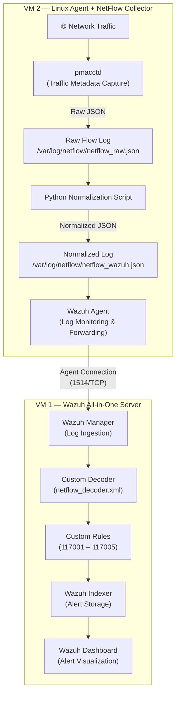

# Architecture

## Overview

This PoC uses a two-VM design. No additional servers, appliances, or cloud services are required.

## VM 1 — Wazuh All-in-One Server

This VM runs the complete Wazuh stack as a single-node deployment:

- **Wazuh Manager**: Receives logs from agents, applies decoders and rules, generates alerts.
- **Wazuh Indexer**: Stores and indexes alert data for search and analysis.
- **Wazuh Dashboard**: Web interface for viewing alerts, investigating events, and managing agents.

The Manager is configured with a custom decoder (`netflow_decoder.xml`) and custom rules (`netflow_rules.xml`) to handle normalized NetFlow events.

**Recommended specs:**
- 4 vCPU, 8 GB RAM, 50 GB disk
- Ubuntu 22.04 or CentOS 8+

## VM 2 — Linux Agent + NetFlow Collector

This VM serves a dual purpose. It acts as a Wazuh Agent endpoint and also runs the NetFlow collection pipeline.

**Components on this VM:**

1. **pmacctd** — A passive traffic accounting daemon from the pmacct project. It listens on a network interface and writes traffic metadata (source/destination IP, ports, protocol, bytes, packets) to a JSON log file.

2. **Python normalization script** — Reads the raw pmacctd output and converts it into a structured JSON format that Wazuh can parse with the custom decoder. Fields are renamed, timestamps are standardized, and flow duration is calculated.

3. **Wazuh Agent** — Monitors the normalized JSON log file (`/var/log/netflow/netflow_wazuh.json`) and forwards each log entry to the Wazuh Manager.

**Recommended specs:**
- 2 vCPU, 2 GB RAM, 20 GB disk
- Ubuntu 22.04 or similar Linux distribution

## Data Flow Diagram

## Network Requirements

- VM 2 must be able to reach VM 1 on port 1514/TCP (agent enrollment and log forwarding).
- VM 2 must be able to reach VM 1 on port 1515/TCP (agent registration).
- VM 1 must be accessible on port 443 (Dashboard web interface).
- VM 2 needs access to the network segment you want to monitor (pmacctd captures from a local interface).

## Design Decisions

**Why All-in-One?**
For a PoC, a single-node Wazuh deployment is the simplest way to demonstrate the full pipeline. Splitting Manager, Indexer, and Dashboard across separate VMs adds complexity without changing the detection logic.

**Why pmacctd instead of NetFlow exports?**
pmacctd runs locally and captures traffic directly from the VM's interface. This avoids the need for a network device that supports NetFlow v5/v9 exports, making the PoC accessible in any lab environment.

**Why a separate normalization step?**
pmacctd outputs raw JSON with its own field naming conventions. Wazuh decoders work best when the log format is predictable and consistent. The Python script bridges that gap by producing a clean, standardized JSON structure.
