# Detection Logic

This document explains the custom Wazuh decoder and rules used to detect network flow anomalies.

## Important: Wazuh 4.x JSON Field Handling

Wazuh 4.x does not support dot notation (e.g. `netflow.dst_port`) in rule `<field>` tags for nested JSON. All fields in the normalized log are therefore **flat** (e.g. `nf_src_ip`, `nf_dst_port`). The Python normalization script outputs flat JSON directly.

## Decoder

File: `rules/decoders/netflow_decoder.xml`

The built-in Wazuh `json` decoder handles field extraction automatically. The custom decoder registers the `netflow_json` name for documentation purposes. Rules match events using `<decoded_as>json</decoded_as>` combined with `<field name="nf_src_ip">` to identify NetFlow events specifically.

## Normalized Log Field Reference

| Field       | Type   | Description                     |
|-------------|--------|---------------------------------|
| timestamp   | string | ISO 8601 timestamp              |
| nf_src_ip   | string | Source IP address               |
| nf_dst_ip   | string | Destination IP address          |
| nf_src_port | string | Source port                     |
| nf_dst_port | string | Destination port                |
| nf_protocol | string | Protocol (tcp, udp, icmp, etc.) |
| nf_packets  | string | Packet count                    |
| nf_bytes    | string | Byte count                      |
| nf_duration | string | Flow duration in seconds        |

## Detection Rules

### Rule 117001 - Base Rule (Level 3)
Matches any event containing `nf_src_ip`. All other rules depend on this.

### Rule 117002 - High Connection Volume (Level 8)
20+ events from the same source IP within 60 seconds. Indicates scanning or aggressive outbound activity.

### Rule 117003 - Suspicious Destination Port (Level 7)
Ports: 4444, 5555, 6666, 7777, 8888, 9999, 1337, 31337, 8443, 9090, 2222, 3333. Associated with reverse shells, backdoors, and offensive tooling.

### Rule 117004 - Repeated Connection to Same Destination (Level 6)
10+ connections to the same destination IP within 120 seconds. Indicates beaconing or persistent connection attempts.

### Rule 117005 - Large Data Transfer (Level 10)
Flow with bytes > 500,000. Potential data exfiltration or large unauthorized transfer.

### Rule 117006 - ICMP Flood (Level 8)
15+ ICMP events from the same source within 30 seconds. Indicates DoS or network sweep.

### Rule 117007 - UDP Flood (Level 8)
25+ UDP events from the same source within 30 seconds. Indicates UDP-based DoS activity.

### Rule 117008 - SSH Brute Force via NetFlow (Level 10)
15+ connections to port 22 from the same source within 60 seconds.

### Rule 117009 - Port Scan (Level 9)
15+ connections from the same source within 30 seconds - broad connection pattern consistent with scanning.

### Rule 117010 - RDP Exposure (Level 12)
5+ connections to port 3389 from the same external host within 60 seconds. High severity - RDP exposed to internet is a critical risk.

### Rule 117011 - DNS Tunneling (Level 10)
30+ DNS (port 53) connections from the same source within 60 seconds. High frequency DNS is a strong indicator of tunneling.

### Rule 117012 - SMB Lateral Movement (Level 9)
Any traffic on port 445. SMB should not be visible externally and is a common lateral movement vector.

### Rule 117013 - Telnet Detected (Level 10)
Any connection on port 23. Telnet transmits credentials in cleartext and should not be in use in any enterprise environment.

### Rule 117014 - FTP Detected (Level 8)
Any connection on port 21. FTP transmits credentials in cleartext and is a common exfiltration vector.

### Rule 117015 - Database Port Access (Level 10)
Ports: 3306 (MySQL), 5432 (PostgreSQL), 1433 (MSSQL), 1521 (Oracle), 27017 (MongoDB). Database ports should never be directly reachable from external hosts.

### Rule 117016 - Tor Network Activity (Level 11)
Ports: 9001, 9050, 9150, 9051. Tor usage in an enterprise environment is high-risk and often policy-violating.

### Rule 117017 - Cryptocurrency Mining (Level 9)
Ports: 3333, 8333, 45700, 14444. Associated with common mining pool connections.

### Rule 117018 - High Outbound Volume (Level 10)
30+ outbound flow events from one host within 60 seconds. Possible data staging or exfiltration behavior.

### Rule 117019 - SNMP Reconnaissance (Level 8)
Any traffic on ports 161/162. SNMP queries to external IPs indicate reconnaissance or misconfiguration.

### Rule 117020 - NetBIOS Traffic (Level 9)
Ports 137, 138, 139. NetBIOS traffic to external IPs indicates misconfiguration or lateral movement attempt.
**Confirmed firing in lab** against real traffic from `103.153.61.85`.

### Rule 117021 - C2 Beaconing (Level 11)
10+ connections to the same destination IP within 300 seconds. Periodic, low-volume connections to the same host are a strong beaconing indicator.
**Confirmed firing in lab** against real traffic from `176.65.149.230`.

### Rule 117022 - VNC Remote Access (Level 8)
Ports 5900, 5901, 5902. VNC traffic should be controlled and not exposed externally.

### Rule 117023 - LDAP Reconnaissance (Level 10)
Ports 389, 636, 3268, 3269. LDAP/LDAPS queries to external hosts indicate directory service enumeration.

### Rule 117024 - DNS Exfiltration (Level 12)
Port 53 with bytes > 10,000. Large DNS payloads are the primary indicator of DNS-based data exfiltration.

## Rule Dependency Chain

```mermaid
flowchart TD
    A["117001 - Base Rule\nNetFlow event received\nLevel 3"]

    A --> B["117002 - High Volume\nLevel 8 · Frequency"]
    A --> C["117003 - Suspicious Port\nLevel 7 · Field Match"]
    A --> D["117004 - Repeated Dst\nLevel 6 · Frequency"]
    A --> E["117005 - Large Transfer\nLevel 10 · Field Match"]
    A --> F["117006 - ICMP Flood\nLevel 8 · Frequency"]
    A --> G["117007 - UDP Flood\nLevel 8 · Frequency"]
    A --> H["117008 - SSH BruteForce\nLevel 10 · Frequency"]
    A --> I["117009 - Port Scan\nLevel 9 · Frequency"]
    A --> J["117010 - RDP Exposure\nLevel 12 · Frequency"]
    A --> K["117011 - DNS Tunneling\nLevel 10 · Frequency"]
    A --> L["117012 - SMB Lateral\nLevel 9 · Field Match"]
    A --> M["117013 - Telnet\nLevel 10 · Field Match"]
    A --> N["117014 - FTP\nLevel 8 · Field Match"]
    A --> O["117015 - DB Port\nLevel 10 · Field Match"]
    A --> P["117016 - Tor\nLevel 11 · Field Match"]
    A --> Q["117017 - CryptoMining\nLevel 9 · Field Match"]
    A --> R["117018 - High Outbound\nLevel 10 · Frequency"]
    A --> S["117019 - SNMP Recon\nLevel 8 · Field Match"]
    A --> T["117020 - **NetBIOS** \nLevel 9 · Field Match"]
    A --> U["117021 - **C2 Beacon** \nLevel 11 · Frequency"]
    A --> V["117022 - VNC\nLevel 8 · Field Match"]
    A --> W["117023 - LDAP Recon\nLevel 10 · Field Match"]
    A --> X["117024 - DNS Exfil\nLevel 12 · Field Match"]
```



**Bold Text** = Confirmed firing against real lab traffic.

## Testing Rules

Use `wazuh-logtest` on VM 1:

```bash
sudo /var/ossec/bin/wazuh-logtest
```

Test C2 beaconing (rule 117021):
```
{"timestamp":"2026-05-26T09:43:02Z","nf_src_ip":"176.65.149.230","nf_dst_ip":"160.22.251.9","nf_src_port":"48640","nf_dst_port":"59983","nf_protocol":"tcp","nf_packets":"1","nf_bytes":"40","nf_duration":"0"}
```

Test suspicious port (rule 117003):
```
{"timestamp":"2026-05-26T09:33:14Z","nf_src_ip":"43.228.157.8","nf_dst_ip":"160.22.251.9","nf_src_port":"25866","nf_dst_port":"4444","nf_protocol":"tcp","nf_packets":"1","nf_bytes":"52","nf_duration":"0"}
```
