# Detection Logic

This document explains the custom Wazuh decoder and rules used to detect network flow anomalies.

## Important: Wazuh 4.x JSON Field Handling

Wazuh 4.x does not support dot notation (e.g. `netflow.dst_port`) in rule `<field>` tags for nested JSON. All fields in the normalized log are **flat** with `nf_` prefix (e.g. `nf_src_ip`, `nf_dst_port`). The Python normalization script outputs flat JSON with **integer** values for numeric fields.

## Normalized Log Field Reference

| Field       | Type    | Description                                     |
|-------------|---------|-------------------------------------------------|
| timestamp   | string  | ISO 8601 timestamp from pmacctd timestamp_start |
| nf_src_ip   | string  | Source IP address                               |
| nf_dst_ip   | string  | Destination IP address                          |
| nf_src_port | integer | Source port                                     |
| nf_dst_port | integer | Destination port                                |
| nf_protocol | string  | Protocol (tcp, udp, icmp, etc.)                 |
| nf_packets  | integer | Packet count                                    |
| nf_bytes    | integer | Byte count                                      |
| nf_duration | integer | Flow duration in seconds                        |

## OpenSearch Scripted Fields

Because index mapping locks field types on first ingestion, if `nf_bytes` and `nf_packets` were indexed as strings before the integer fix, create scripted fields in OpenSearch Dashboard:

**nf_bytes_num:**
```
if (doc['data.nf_bytes'].size() > 0) { return Integer.parseInt(doc['data.nf_bytes'].value) } return 0
```

**nf_packets_num:**
```
if (doc['data.nf_packets'].size() > 0) { return Integer.parseInt(doc['data.nf_packets'].value) } return 0
```

These scripted fields enable Sum aggregation for traffic volume visualizations.

## Detection Rules Summary

| Rule ID | Level | Category         | Description                               | Lab Confirmed |
|---------|-------|------------------|-------------------------------------------|---------------|
| 117001  | 3     | Base             | NetFlow event received                    | Confirmed     |
| 117002  | 8     | Anomaly          | High connection volume from single source | -             |
| 117003  | 7     | Anomaly          | Suspicious destination port               | Confirmed     |
| 117004  | 6     | Anomaly          | Repeated connection to same destination   | -             |
| 117005  | 10    | Exfiltration     | Large data transfer (>500KB)              | -             |
| 117006  | 8     | DoS              | ICMP flood                                | -             |
| 117007  | 8     | DoS              | UDP flood                                 | -             |
| 117008  | 10    | Brute Force      | SSH brute force                           | Confirmed     |
| 117009  | 9     | Recon            | Port scan                                 | -             |
| 117010  | 12    | Remote Access    | RDP access attempt                        | Confirmed     |
| 117011  | 10    | Tunneling        | High volume DNS - possible tunneling      | -             |
| 117012  | 9     | Lateral Movement | SMB traffic                               | Confirmed     |
| 117013  | 10    | Cleartext        | Telnet connection                         | Confirmed     |
| 117014  | 8     | Cleartext        | FTP connection                            | Confirmed     |
| 117015  | 10    | Database         | Database port access from external        | Confirmed     |
| 117016  | 11    | Evasion          | Tor-related port                          | -             |
| 117017  | 9     | Policy           | Cryptocurrency mining port                | -             |
| 117018  | 10    | Exfiltration     | High outbound traffic volume              | -             |
| 117019  | 8     | Recon            | SNMP reconnaissance                       | -             |
| 117020  | 9     | Lateral Movement | NetBIOS traffic                           | Confirmed     |
| 117021  | 11    | C2               | Possible C2 beaconing                     | Confirmed     |
| 117022  | 8     | Remote Access    | VNC remote access                         | Confirmed     |
| 117023  | 10    | Recon            | LDAP reconnaissance                       | -             |
| 117024  | 12    | Exfiltration     | High bytes over DNS                       | -             |

## Rule Dependency Chain

```mermaid
flowchart TD
    A["117001 - Base Rule\nNetFlow event received\nLevel 3"]

    A --> B["117002 - High Volume\nLevel 8 · Frequency"]
    A --> C["117003 - Suspicious Port Real Data\nLevel 7 · Field Match"]
    A --> D["117004 - Repeated Dst\nLevel 6 · Frequency"]
    A --> E["117005 - Large Transfer\nLevel 10 · Field Match"]
    A --> F["117006 - ICMP Flood\nLevel 8 · Frequency"]
    A --> G["117007 - UDP Flood\nLevel 8 · Frequency"]
    A --> H["117008 - SSH BruteForce Real Data\nLevel 10 · Frequency"]
    A --> I["117009 - Port Scan\nLevel 9 · Frequency"]
    A --> J["117010 - RDP Exposure Real Data\nLevel 12 · Frequency"]
    A --> K["117011 - DNS Tunneling\nLevel 10 · Frequency"]
    A --> L["117012 - SMB Lateral Real Data\nLevel 9 · Field Match"]
    A --> M["117013 - Telnet Real Data\nLevel 10 · Field Match"]
    A --> N["117014 - FTP Real Data\nLevel 8 · Field Match"]
    A --> O["117015 - DB Port Real Data\nLevel 10 · Field Match"]
    A --> P["117016 - Tor\nLevel 11 · Field Match"]
    A --> Q["117017 - CryptoMining\nLevel 9 · Field Match"]
    A --> R["117018 - High Outbound\nLevel 10 · Frequency"]
    A --> S["117019 - SNMP Recon\nLevel 8 · Field Match"]
    A --> T["117020 - NetBIOS Real Data\nLevel 9 · Field Match"]
    A --> U["117021 - C2 Beacon Real Data\nLevel 11 · Frequency"]
    A --> V["117022 - VNC Real Data\nLevel 8 · Field Match"]
    A --> W["117023 - LDAP Recon\nLevel 10 · Field Match"]
    A --> X["117024 - DNS Exfil\nLevel 12 · Field Match"]
```



Real Data = Confirmed firing against real internet traffic in lab.

## Real Traffic Detection Results

VM exposed to internet on Eranya Cloud. Within hours, automated scanners detected:

| Timestamp | Rule       | Attacker IP    | Finding                           |
|-----------|------------|----------------|-----------------------------------|
| 16:50:34  | 117010 L12 | 87.251.64.25   | RDP scanner - 4 hits in <1 second |
| 16:52:02  | 117013 L10 | 43.241.37.250  | Telnet scan port 23               |
| 16:53:02  | 117013 L10 | 198.46.134.48  | Telnet scan port 23               |
| 16:52:02  | 117015 L10 | 45.156.87.127  | MySQL port 3306 scan              |
| 16:50:35  | 117015 L10 | 64.89.163.133  | PostgreSQL port 5432 scan         |
| 17:08:14  | 117020 L9  | 103.153.61.85  | NetBIOS broadcast - 2,425 hits    |
| 16:50:36  | 117021 L11 | 185.224.128.16 | C2 beaconing pattern              |
| 16:50:34  | 117022 L8  | 45.227.10.15   | VNC port 5900 scan                |

**Total alerts in ~5 hours: 2,490 - with 982 at level 9 or above.**

## Testing Rules

Use wazuh-logtest on VM 1:

```bash
sudo /var/ossec/bin/wazuh-logtest
```

Test RDP scanner (rule 117010):
```
{"timestamp":"2026-05-26T09:50:32Z","nf_src_ip":"87.251.64.25","nf_dst_ip":"160.22.251.9","nf_src_port":15844,"nf_dst_port":3389,"nf_protocol":"tcp","nf_packets":5,"nf_bytes":240,"nf_duration":0}
```

Test Telnet (rule 117013):
```
{"timestamp":"2026-05-26T09:52:01Z","nf_src_ip":"43.241.37.250","nf_dst_ip":"160.22.251.9","nf_src_port":57618,"nf_dst_port":23,"nf_protocol":"tcp","nf_packets":1,"nf_bytes":40,"nf_duration":0}
```

Test NetBIOS (rule 117020):
```
{"timestamp":"2026-05-26T09:43:02Z","nf_src_ip":"103.153.61.85","nf_dst_ip":"103.153.61.255","nf_src_port":138,"nf_dst_port":138,"nf_protocol":"udp","nf_packets":1,"nf_bytes":229,"nf_duration":0}
```
